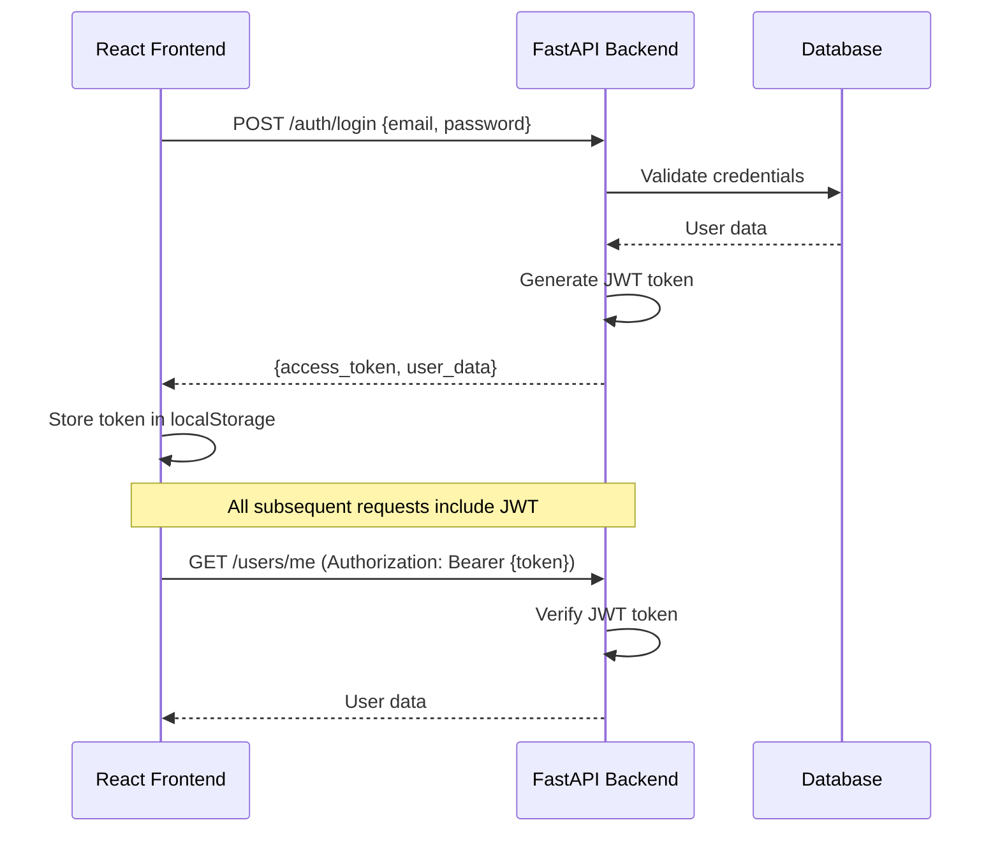
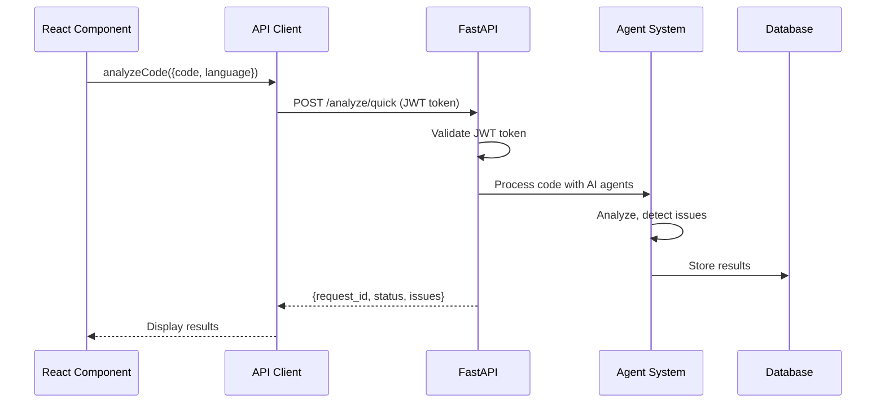
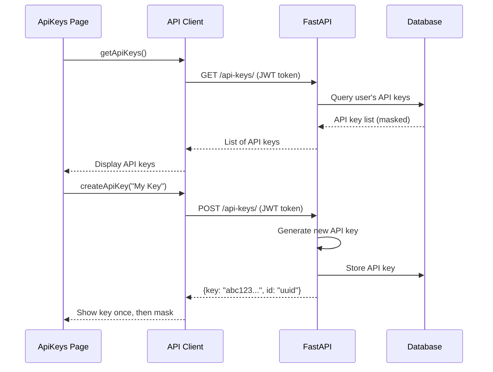

# AgentLogger API Architecture: Server-Side vs Client-Side

## Overview

AgentLogger uses a clear separation between **server-side** (FastAPI backend) and **client-side** (React frontend) with well-defined API contracts and authentication flows.

## 🏗️ Architecture Overview

```
┌─────────────────────────────────────────────────────────────────────────────┐
│                              CLIENT SIDE                                   │
├─────────────────────────────────────────────────────────────────────────────┤
│  React App (Port 5173)                                                     │
│  ├── Authentication Context (JWT Management)                               │
│  ├── API Client (lib/api.ts)                                              │
│  ├── Protected Routes                                                      │
│  └── UI Components                                                         │
└─────────────────────────────────────────────────────────────────────────────┘
                                       │
                                  HTTP API Calls
                                       │
┌─────────────────────────────────────────────────────────────────────────────┐
│                              SERVER SIDE                                   │
├─────────────────────────────────────────────────────────────────────────────┤
│  FastAPI Backend (Port 8000)                                              │
│  ├── API Endpoints (/api/v1/*)                                           │
│  ├── Authentication Middleware                                            │
│  ├── Agent System (AI Processing)                                         │
│  ├── Database Services                                                    │
│  └── Background Tasks                                                     │
└─────────────────────────────────────────────────────────────────────────────┘
```

## 🔐 Authentication Architecture

### Two Authentication Methods

1. **JWT Tokens** (Web Interface)
   - **Server-Side**: Issues JWT tokens via `/auth/login` and `/auth/register`
   - **Client-Side**: Stores tokens in localStorage, includes in `Authorization: Bearer {token}` header
   - **Usage**: Web dashboard, user management, OAuth flows

2. **API Keys** (Programmatic Access)
   - **Server-Side**: Validates API keys via middleware, associates with user accounts
   - **Client-Side**: Uses API keys for backend communication in some contexts
   - **Usage**: External integrations, CLI tools, direct API access

### Authentication Flow



## 📡 API Endpoints Breakdown

### Server-Side Endpoints

| Category | Endpoint | Method | Purpose | Authentication |
|----------|----------|---------|---------|---------------|
| **Authentication** | `/auth/login` | POST | User login | None |
| | `/auth/register` | POST | User registration | None |
| | `/auth/github/authorize` | GET | GitHub OAuth URL | None |
| | `/auth/google/authorize` | GET | Google OAuth URL | None |
| **User Management** | `/users/me` | GET | Get current user | JWT |
| | `/users/` | GET | List users (admin) | JWT |
| **API Keys** | `/api-keys/` | GET | List user's API keys | JWT |
| | `/api-keys/` | POST | Create new API key | JWT |
| | `/api-keys/{id}` | DELETE | Delete API key | JWT |
| **Code Analysis** | `/analyze/quick` | POST | Quick code analysis | JWT/API Key |
| | `/analyze/` | POST | Create analysis request | JWT/API Key |
| | `/analyze/{id}` | GET | Get analysis result | JWT/API Key |
| **Fix Generation** | `/fix/` | POST | Generate code fix | JWT/API Key |
| | `/fix/{id}` | GET | Get fix result | JWT/API Key |
| **Error Explanation** | `/explain/` | POST | Explain error message | JWT/API Key |
| **Health Check** | `/health/` | GET | System health status | None |
| **GitHub Integration** | `/github/pr/{id}/status` | GET | Check PR status | JWT/API Key |

### Client-Side API Integration

The frontend uses a centralized API client (`frontend/src/lib/api.ts`) that:

1. **Manages Authentication**
   ```typescript
   const apiRequest = async (endpoint: string, options: RequestInit = {}, useJwtAuth: boolean = false) => {
     const headers = { "Content-Type": "application/json" };
     
     if (useJwtAuth) {
       const token = getJwtToken();
       if (token) {
         headers["Authorization"] = `Bearer ${token}`;
       }
     }
     
     const response = await fetch(`${API_BASE_URL}${endpoint}`, { ...options, headers });
     return response.json();
   };
   ```

2. **Handles Errors**
   ```typescript
   if (!response.ok) {
     const errorData = await response.json().catch(() => ({}));
     throw new Error(errorData.detail || `HTTP error! status: ${response.status}`);
   }
   ```

3. **Provides Typed Interfaces**
   ```typescript
   export interface AnalysisResult {
     request_id: string;
     status: "pending" | "completed" | "failed";
     issues?: CodeIssue[];
     error?: string;
   }
   ```

## 🔄 Data Flow Examples

### 1. Code Analysis Flow



### 2. API Key Management Flow



## 🛡️ Security Implementation

### Server-Side Security

1. **Authentication Middleware**
   ```python
   # Validates JWT tokens and API keys
   @app.middleware("http")
   async def auth_middleware(request: Request, call_next):
       if request.url.path.startswith("/api/v1/"):
           # Extract and validate authentication
           user_id = await validate_auth(request)
           request.state.user_id = user_id
       return await call_next(request)
   ```

2. **Request Validation**
   ```python
   # Each endpoint validates user ownership
   user_id = getattr(request.state, 'user_id', None)
   if not user_id:
       raise HTTPException(status_code=401, detail="Authentication required")
   ```

### Client-Side Security

1. **Token Management**
   ```typescript
   // Secure token storage and retrieval
   export const getJwtToken = (): string | null => {
     return localStorage.getItem(JWT_TOKEN_STORAGE_KEY);
   };
   
   export const logout = (): void => {
     localStorage.removeItem(JWT_TOKEN_STORAGE_KEY);
     localStorage.removeItem(USER_STORAGE_KEY);
   };
   ```

2. **Protected Routes**
   ```typescript
   const ProtectedRoute = ({ children }: { children: React.ReactNode }) => {
     const { isAuthenticated, isLoading } = useAuth();
     
     if (!isAuthenticated) {
       return <Navigate to="/signin" replace />;
     }
     
     return <>{children}</>;
   };
   ```

## 🎯 Key Separation of Concerns

### Server-Side Responsibilities

- **Authentication & Authorization**: JWT validation, API key management
- **Business Logic**: Code analysis, fix generation, error explanation
- **Data Persistence**: Database operations, user management
- **AI Integration**: Agent system coordination, LLM communication
- **Background Processing**: Asynchronous task execution

### Client-Side Responsibilities

- **User Interface**: React components, form handling, navigation
- **State Management**: Authentication context, local state
- **API Communication**: HTTP requests, response handling
- **User Experience**: Loading states, error messages, notifications
- **Routing**: Page navigation, protected routes

## 📊 Performance Considerations

### Server-Side Optimizations

1. **Asynchronous Processing**
   ```python
   # Background tasks for long-running operations
   background_tasks.add_task(analyze_code_background, db, analysis_id, agent_system)
   ```

2. **Database Indexing**
   ```python
   # Efficient queries with proper indexes
   analyses = await get_analysis_requests_by_user(db, user_id)
   ```

### Client-Side Optimizations

1. **Request Caching**
   ```typescript
   // React Query for caching and synchronization
   const { data: user } = useQuery('currentUser', getCurrentUser);
   ```

2. **Lazy Loading**
   ```typescript
   // Code splitting for better performance
   const Dashboard = lazy(() => import('./pages/Dashboard'));
   ```

## 🔍 Error Handling Strategy

### Server-Side Error Handling

```python
try:
    result = await process_analysis(code, language)
    return AnalysisResult(status="completed", issues=result.issues)
except ValidationError as e:
    raise HTTPException(status_code=400, detail=str(e))
except Exception as e:
    logger.error(f"Analysis failed: {e}")
    raise HTTPException(status_code=500, detail="Internal server error")
```

### Client-Side Error Handling

```typescript
try {
  const result = await quickAnalyzeCode(request);
  setAnalysisResult(result);
  toast.success("Analysis complete!");
} catch (error) {
  const errorMessage = error instanceof Error ? error.message : "Unknown error";
  toast.error(`Analysis failed: ${errorMessage}`);
}
```

## 🚀 Development & Testing

### Server-Side Development

```bash
# Start backend server
python -m uvicorn app.main:app --reload --port 8000

# Access API documentation
curl http://localhost:8000/docs
```

### Client-Side Development

```bash
# Start frontend development server
cd frontend && npm run dev

# Access application
open http://localhost:5173
```

### Integration Testing

```bash
# Test API endpoints
curl -H "Authorization: Bearer {token}" http://localhost:8000/api/v1/users/me

# Test frontend-backend communication
# Visit playground and submit code for analysis
```

## 📚 API Documentation

- **Interactive API Docs**: `http://localhost:8000/docs`
- **OpenAPI Spec**: `http://localhost:8000/openapi.json`
- **ReDoc Documentation**: `http://localhost:8000/redoc`

This architecture ensures clear separation of concerns, secure authentication, and efficient communication between the frontend and backend components of AgentLogger. 