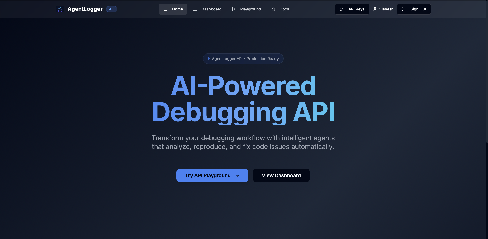

# AgentLogger - AI-Powered Debugging API



[](https://github.com/yourusername/AgentLogger)
[](https://www.python.org/downloads/)
[](https://fastapi.tiangolo.com/)
[](https://reactjs.org/)
[](https://opensource.org/licenses/MIT)

AgentLogger is an advanced AI-powered debugging API that helps developers identify, understand, and fix code issues using intelligent agent workflows. Built with a modern React frontend and robust FastAPI backend.

## 🌟 What Makes AgentLogger Special

🤖 **Multi-Agent Intelligence** - Specialized AI agents for analysis, explanation, and fixing  
⚡ **Lightning Fast** - Get code analysis and fixes in seconds  
🎨 **Beautiful Interface** - Modern dark theme with intuitive design  
🔑 **Secure Authentication** - Enterprise-grade API key management  
🐳 **Easy Deployment** - One-command Docker setup  
📊 **Analytics Dashboard** - Track usage and performance metrics  
🛠️ **Developer Friendly** - RESTful API with comprehensive documentation  
☁️ **Cloud Ready** - Deploy anywhere (VPS, AWS, GCP, Vercel)

## 🏗️ Agent Architecture

```
┌─────────────────┐    ┌─────────────────┐
│                 │    │                 │
│  Analyzer Agent │    │ Coordinator     │
│  (Syntax & Logic│    │ Agent (Router)  │
│   Analysis)     │    │                 │
│                 │    │                 │
└────────┬────────┘    └────────┬────────┘
         │                      │
         │                      │
         ▼                      ▼
┌─────────────────┐    ┌─────────────────┐
│                 │    │                 │
│  Fix Generator  │    │ Explanation     │
│  Agent (Auto    │    │ Agent (Error    │
│   Repair)       │    │  Details)       │
│                 │    │                 │
└────────┬────────┘    └────────┬────────┘
         │                      │
         │                      │
         ▼                      ▼
┌─────────────────────────────────────────┐
│                                         │
│           Coordinator Agent             │
│           (Message Router)              │
└─────────────────┬───────────────────────┘
                  │
                  ▼
┌─────────────────────────────────────────┐
│                                         │
│         Database Layer                  │
│      (Analysis Results & API Keys)      │
└─────────────────────────────────────────┘
```

## 🛠️ Technology Stack

- **Frontend**: React 18, TypeScript, Vite, TailwindCSS, shadcn/ui
- **Backend**: Python 3.11+, FastAPI, SQLAlchemy, Alembic
- **AI**: Groq LLM Integration (Llama3-70B)
- **Database**: PostgreSQL (production) / SQLite (development)
- **Authentication**: API Key-based with middleware
- **Deployment**: Docker, Docker Compose, Nginx

## 🚀 How to Run AgentLogger

### 🐳 Method 1: Docker (Recommended - 2 minutes)

**Perfect for**: Quick testing, development, production deployment

```bash
# 1. Clone and enter directory
git clone https://github.com/your-username/AgentLogger.git && cd AgentLogger

# 2. Get your FREE Groq API key from console.groq.com and set it
export GROQ_API_KEY="your_groq_api_key_here"

# 3. Launch everything with Docker
docker-compose up -d

# 4. Open the beautiful web interface
open http://localhost  # macOS
# or visit http://localhost in your browser
```

**What you get:**
- ✅ **Web Interface** at http://localhost - Beautiful dark theme
- ✅ **API Playground** - Interactive code testing
- ✅ **API Documentation** at http://localhost/docs  
- ✅ **Dashboard & Analytics** - Monitor usage
- ✅ **API Key Management** - Create and manage keys

### 💻 Method 2: Manual Installation (5 minutes)

**Perfect for**: Development, learning the codebase, customization

```bash
# Clone repository
git clone https://github.com/your-username/AgentLogger.git
cd AgentLogger

# Backend setup
python -m venv venv
source venv/bin/activate  # Windows: venv\Scripts\activate
pip install -r requirements.txt

# Configure environment
cp env.example .env
# Edit .env and set GROQ_API_KEY=your_actual_key

# Initialize database
python scripts/init_db.py

# Start backend (keep running)
uvicorn app.main:app --host 0.0.0.0 --port 8000 --reload &

# Frontend setup (new terminal)
cd frontend
npm install
npm run dev

# Access the application
# Frontend: http://localhost:8080
# Backend: http://localhost:8000
```

### ☁️ Method 3: Cloud Deployment

**Perfect for**: Production, scaling, sharing with teams

#### Vercel (Frontend + Serverless)
```bash
npm install -g vercel
cd frontend
vercel --prod
```

#### Docker on VPS/Cloud
```bash
# On your server
git clone https://github.com/your-username/AgentLogger.git
cd AgentLogger
cp env.example .env
# Edit .env with production settings
docker-compose -f docker-compose.prod.yml up -d
```

### 🖥️ Method 4: CLI Only (1 minute)

**Perfect for**: Command-line usage, automation, CI/CD integration

```bash
# Install CLI
cd AgentLogger/cli
pip install -e .

# Configure with your API key
agent-logger configure --api-key YOUR_API_KEY

# Use CLI commands
agent-logger analyze --file buggy_code.py
agent-logger explain --code "print(hello world)" --language python
agent-logger fix --file broken_script.js
```

## 🌐 Access Your AgentLogger Instance

Once running, AgentLogger provides multiple access points:

| Service | URL | Description |
|---------|-----|-------------|
| 🏠 **Main App** | http://localhost | Beautiful web interface with all features |
| 🎮 **Playground** | http://localhost/playground | Interactive code analysis and testing |
| 📊 **Dashboard** | http://localhost/dashboard | Usage analytics and management |
| 🔑 **API Keys** | http://localhost/api-keys | Create and manage authentication keys |
| 📚 **API Docs** | http://localhost/docs | Complete API reference and testing |
| 🔧 **Backend Direct** | http://localhost:8000 | Direct API access for developers |

## ⚡ Quick Test

Test your AgentLogger installation:

```bash
# Test via web interface
open http://localhost/playground
# Paste some buggy code and click "Analyze"

# Test via API
curl -X POST http://localhost/api/v1/analyze \
  -H "Content-Type: application/json" \
  -H "X-API-Key: QwF6KA863mAeRHOCY9HJJEccV9Gp0chKTL5pogRjeOU" \
  -d '{"code": "print(hello world)", "language": "python"}'

# Test via CLI (if installed)
agent-logger analyze --code "print(hello world)" --language python
```

## 🔑 API Key Management

AgentLogger includes a full API key management system:

1. **Access API Keys Page**: Click "API Keys" in the navigation
2. **Create New Keys**: Use the "Create API Key" button
3. **Copy Keys**: Click the copy button to copy keys to clipboard
4. **Delete Keys**: Remove unused keys for security

**Default API Key** (for testing): `QwF6KA863mAeRHOCY9HJJEccV9Gp0chKTL5pogRjeOU`

## 🎨 Interface Highlights

The AgentLogger web interface features a modern, professional design:

- **🌙 Dark Theme**: Easy on the eyes with beautiful gradients
- **📱 Responsive Design**: Works perfectly on desktop, tablet, and mobile
- **🎯 Intuitive Navigation**: Clean header with easy access to all features
- **✨ Gradient Typography**: Eye-catching blue-to-purple text gradients
- **🔔 Status Indicators**: "Production Ready" badges and real-time status
- **⚡ Quick Actions**: "Try API Playground" and "View Dashboard" buttons
- **👤 User Management**: Seamless authentication with user profile display

Navigate through:
- **🏠 Home**: Main landing page with overview and quick actions
- **📊 Dashboard**: Comprehensive view of your API usage and analytics  
- **🎮 Playground**: Interactive interface to test debugging capabilities
- **📚 Docs**: Complete documentation and API reference
- **🔑 API Keys**: Secure key management with create/view/delete operations

## 📖 Usage Examples

### Analyze Code via Web Interface
1. Navigate to http://localhost
2. Go to "Playground" 
3. Paste your code
4. Click "Analyze" to get AI-powered analysis

### API Usage
```bash
# Analyze code with syntax errors
curl -X POST http://localhost/api/v1/analyze \
  -H "Content-Type: application/json" \
  -H "X-API-Key: YOUR_API_KEY" \
  -d '{
    "code": "print(hello world)",
    "language": "python"
  }'

# Get explanations for errors
curl -X POST http://localhost/api/v1/explain \
  -H "Content-Type: application/json" \
  -H "X-API-Key: YOUR_API_KEY" \
  -d '{
    "code": "print(hello world)",
    "traceback": "SyntaxError: invalid syntax",
    "language": "python"
  }'
```

## 🔧 Configuration

Key environment variables (see `docs/guides/configuration.md` for complete reference):

| Variable | Description | Default | Required |
|----------|-------------|---------|----------|
| `GROQ_API_KEY` | Your Groq LLM API key | - | ✅ Yes |
| `GROQ_MODEL` | LLM model to use | `llama3-70b-8192` | No |
| `DATABASE_URL` | Database connection | `sqlite:///./agentlogger.db` | No |
| `API_V1_STR` | API version prefix | `/api/v1` | No |
| `CORS_ORIGINS` | Allowed origins | `["http://localhost:8082"]` | No |

## 📚 Documentation

- **[Getting Started Guide](docs/guides/getting-started.md)** - Detailed setup instructions
- **[API Documentation](docs/api/index.md)** - Complete API reference
- **[Configuration Guide](docs/guides/configuration.md)** - All configuration options
- **[Development Setup](docs/development/development-setup.md)** - Local development
- **[Agent Architecture](docs/development/agent-architecture.md)** - System design

## 🐛 Development

### Local Development Setup
```bash
# Backend setup
python -m venv venv
source venv/bin/activate  # or `venv\Scripts\activate` on Windows
pip install -r requirements.txt

# Frontend setup  
cd frontend
npm install
npm run dev

# Run backend
cd ..
python -m uvicorn app.main:app --reload
```

See [Development Setup](docs/development/development-setup.md) for detailed instructions.

### Testing
```bash
# Run backend tests
pytest

# Run frontend tests  
cd frontend && npm test
```

## 🔍 Current Status

✅ **Fully Functional**
- Multi-agent workflow system
- Code analysis and fixing
- API key authentication  
- Web interface with all pages
- Database operations
- CORS configuration
- Error handling

✅ **Recently Fixed Issues**
- UUID handling in database queries
- API keys CRUD operations
- Frontend routing and navigation
- CORS configuration for all ports
- Authentication middleware

## 🤝 Contributing

See [Contributing Guide](docs/development/contributing.md) for:
- Code style guidelines
- Development workflow
- Testing requirements
- Pull request process

## 📄 License

MIT License - see [LICENSE](LICENSE) file for details.

## 🆘 Support

- **Issues**: Create a GitHub issue for bugs or feature requests
- **Documentation**: Check the `docs/` directory for detailed guides
- **FAQ**: See [docs/guides/faq.md](docs/guides/faq.md) for common questions