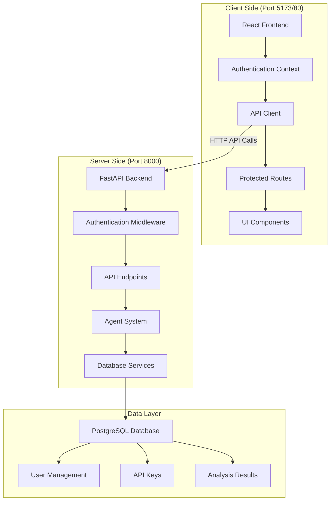
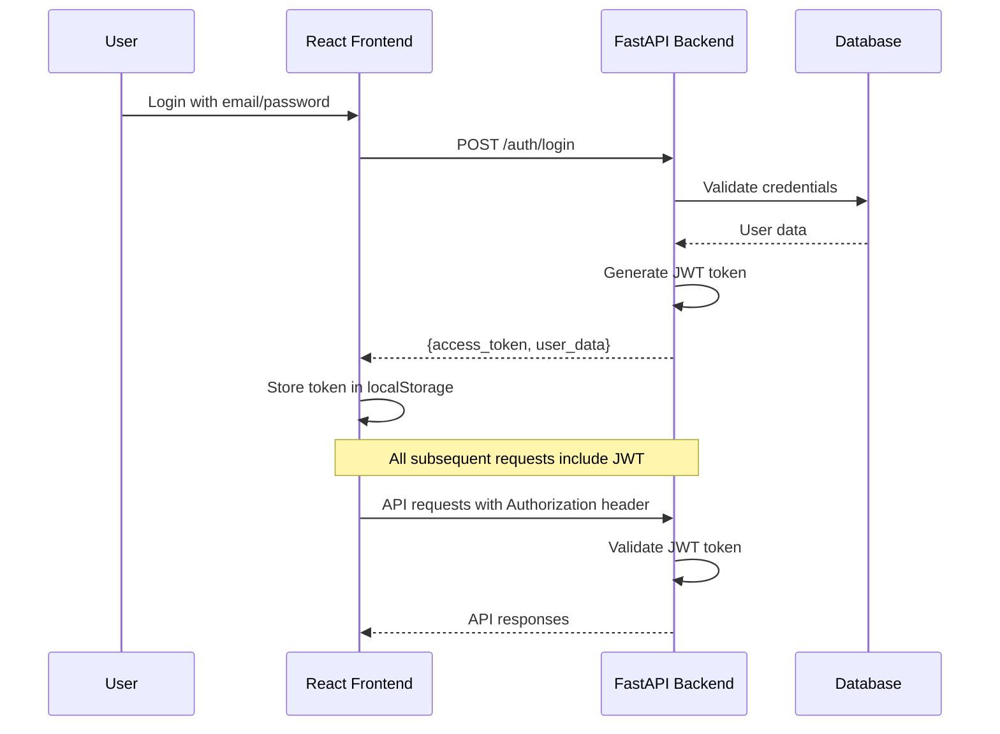

# AgentLogger Architecture Guide

## 📖 Complete Architecture Documentation

This guide provides a comprehensive overview of AgentLogger's architecture and serves as a navigation hub for all architectural documentation.

## 🏗️ Architecture Overview

AgentLogger implements a modern **server-side / client-side** architecture with clear separation of concerns, secure authentication, and scalable design patterns.

### **System Components**



## 📚 Documentation Navigation

### **🔧 Complete API Documentation**

1. **[API Overview](api/index.md)**
   - Complete API reference with all endpoints
   - Authentication methods (JWT + API Keys)
   - Request/response schemas
   - HTTP status codes
   - Development and testing guides

2. **[Server-Client Architecture](api/SERVER_CLIENT_ARCHITECTURE.md)**
   - Detailed architectural overview
   - Authentication flow diagrams
   - Security implementation
   - Performance considerations
   - Error handling strategies

3. **[API Usage Examples](api/API_USAGE_EXAMPLES.md)**
   - Real-world implementation examples
   - Frontend and backend code samples
   - Complete request/response flows
   - Error handling patterns
   - Integration testing examples

### **🏗️ System Architecture**

4. **[Agent Architecture](development/agent-architecture.md)**
   - Multi-agent system design
   - Agent communication patterns
   - AI integration details
   - Workflow orchestration

5. **[Project Structure](development/project-structure.md)**
   - Codebase organization
   - Directory structure
   - Component relationships
   - Design patterns used

### **🚀 Development Documentation**

6. **[Development Setup](development/development-setup.md)**
   - Local development environment
   - Prerequisites and dependencies
   - Step-by-step setup guide
   - Troubleshooting common issues

7. **[Frontend Development](development/frontend.md)**
   - React component architecture
   - State management patterns
   - API integration patterns
   - UI/UX implementation

### **📋 Setup and Configuration**

8. **[Frontend-Backend Connection](setup/FRONTEND_BACKEND_CONNECTION.md)**
   - Connection configuration
   - Environment setup
   - Troubleshooting connectivity

9. **[Configuration Guide](guides/configuration.md)**
   - Environment variables
   - Database configuration
   - API key management
   - Production settings

## 🔐 Authentication Architecture

### **Dual Authentication System**

AgentLogger implements two complementary authentication methods:

#### **1. JWT Tokens (Web Interface)**
- **Purpose**: User authentication for web interface
- **Storage**: localStorage in frontend
- **Header**: `Authorization: Bearer {token}`
- **Scope**: User-specific access with role-based permissions
- **Lifetime**: 24 hours (configurable)

#### **2. API Keys (Programmatic Access)**
- **Purpose**: Authentication for external integrations
- **Management**: Created/deleted via web interface or API
- **Header**: Can use JWT token for web-based API access
- **Security**: One-time display, immediate revocation capability
- **Tracking**: Last used timestamp, usage analytics

### **Authentication Flow**



## 🔄 Data Flow Patterns

### **Request Processing Flow**

1. **Client Request** → User action triggers API call
2. **Authentication** → Middleware validates JWT/API key
3. **Validation** → Pydantic schemas validate request data
4. **Processing** → Business logic executes (with agent system if needed)
5. **Database** → Data persistence operations
6. **Response** → Structured JSON response returned
7. **UI Update** → Frontend updates based on response

### **Agent System Integration**

```python
# Example: Code Analysis Flow
@router.post("/analyze/quick")
async def quick_analyze(
    data: AnalysisRequestCreate,
    request: Request,
    agent_system: AgentSystem = Depends(get_agent_system_dependency)
):
    # 1. Extract user from authenticated request
    user_id = getattr(request.state, 'user_id', None)
    
    # 2. Process with multi-agent system
    result = await agent_system.process_analysis(data, user_id)
    
    # 3. Store results in database
    await store_analysis_result(db, result, user_id)
    
    # 4. Return structured response
    return AnalysisResult(**result)
```

## 🛡️ Security Architecture

### **Server-Side Security**

- **Authentication Middleware**: Validates all requests
- **Input Validation**: Pydantic schemas prevent injection
- **SQL Injection Protection**: SQLAlchemy ORM usage
- **Rate Limiting**: Configurable per-endpoint limits
- **CORS Configuration**: Secure cross-origin policies

### **Client-Side Security**

- **Token Management**: Secure storage and automatic cleanup
- **Protected Routes**: Authentication-required navigation
- **Input Sanitization**: Safe handling of user content
- **XSS Prevention**: React's built-in protections

## 📊 Performance Architecture

### **Backend Optimizations**

- **Asynchronous Processing**: Background tasks for long operations
- **Database Indexing**: Optimized query performance
- **Connection Pooling**: Efficient database connections
- **Caching Strategy**: Redis for session and response caching

### **Frontend Optimizations**

- **Code Splitting**: Lazy loading for better performance
- **Request Deduplication**: Avoid redundant API calls
- **State Management**: Efficient React context usage
- **Bundle Optimization**: Vite build optimizations

## 🔧 API Endpoint Categories

### **Authentication Endpoints**
- User registration and login
- OAuth integration (GitHub/Google)
- JWT token management
- Password reset functionality

### **User Management**
- Profile management
- User preferences
- Account settings
- Admin operations

### **API Key Management**
- Create/read/update/delete operations
- Usage tracking and analytics
- Security policies
- Bulk operations

### **Core Analysis**
- Quick code analysis
- Comprehensive code review
- Error explanation
- Fix generation
- Patch creation

### **System Monitoring**
- Health checks
- Agent system status
- Performance metrics
- Error tracking

## 🚀 Deployment Architecture

### **Development Environment**
- Frontend: `npm run dev` (Port 5173)
- Backend: `uvicorn app.main:app --reload` (Port 8000)
- Database: Local PostgreSQL or SQLite

### **Production Environment**
- Frontend: Nginx-served static files (Port 80)
- Backend: Dockerized FastAPI (Port 8000)
- Database: PostgreSQL with connection pooling
- Reverse Proxy: Nginx with load balancing

### **Docker Architecture**

```yaml
# docker-compose.yml structure
services:
  frontend:    # React app served by Nginx
  backend:     # FastAPI application
  database:    # PostgreSQL database
  redis:       # Caching and session storage (optional)
```

## 📋 Quick Reference Links

### **Essential Documentation**
- 🚀 **[Getting Started](guides/getting-started.md)** - Quick setup guide
- 🔧 **[API Reference](api/index.md)** - Complete API documentation
- 🏗️ **[Architecture Details](api/SERVER_CLIENT_ARCHITECTURE.md)** - In-depth system design
- 💡 **[Usage Examples](api/API_USAGE_EXAMPLES.md)** - Practical implementation examples

### **Development Resources**
- ⚙️ **[Development Setup](development/development-setup.md)** - Local development
- 🧪 **[Testing Guide](development/testing.md)** - Testing strategies
- 🤝 **[Contributing](development/contributing.md)** - How to contribute
- 📝 **[Project Structure](development/project-structure.md)** - Codebase organization

### **Interactive Tools**
- 🌐 **[Web Interface](http://localhost)** - Main application
- 📖 **[API Docs](http://localhost/docs)** - Interactive API documentation
- 🔍 **[ReDoc](http://localhost/redoc)** - Alternative API documentation

## 🎯 Architecture Principles

### **Separation of Concerns**
- **Frontend**: UI/UX, state management, user interaction
- **Backend**: Business logic, data processing, authentication
- **Database**: Data persistence, relationships, constraints
- **Agents**: AI processing, code analysis, fix generation

### **Scalability**
- **Horizontal Scaling**: Multiple API instances
- **Vertical Scaling**: Resource optimization
- **Database Scaling**: Connection pooling, read replicas
- **Caching**: Redis for performance improvement

### **Maintainability**
- **Type Safety**: TypeScript frontend, Python typing
- **Documentation**: Comprehensive guides and examples
- **Testing**: Unit, integration, and end-to-end tests
- **Code Quality**: Linting, formatting, review processes

### **Security**
- **Authentication**: Multi-method auth system
- **Authorization**: Role-based access control
- **Input Validation**: Comprehensive data validation
- **Secure Communication**: HTTPS, secure headers

---

This architecture guide provides a comprehensive overview of AgentLogger's system design. For specific implementation details, refer to the individual documentation files linked throughout this guide.

**Need help?** Start with the [Getting Started Guide](guides/getting-started.md) or explore the [Interactive API Documentation](http://localhost/docs). 