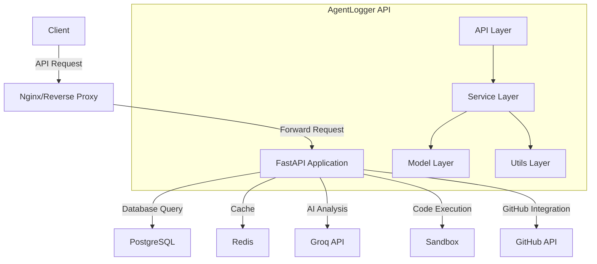

# AgentLogger Architecture

Below is the architecture diagram for the AgentLogger API:

## Component Description

### Client
External applications or users that interact with the AgentLogger API.

### Nginx/Reverse Proxy
Handles incoming HTTP requests, SSL termination, and forwards requests to the FastAPI application.

### FastAPI Application
The main application built with FastAPI that processes API requests and returns responses.

### PostgreSQL
The primary database that stores all persistent data including users, API keys, analyses, and fixes.

### Redis
Optional cache for improving performance and implementing rate limiting.

### Groq API
External AI service used for code analysis and fix generation.

### Sandbox
Isolated environment for executing code safely.

### GitHub API
External service for creating pull requests with fixes.

### Internal Layers

#### API Layer
Handles HTTP requests and responses, input validation, and authentication.

#### Service Layer
Contains the business logic for code analysis, fix generation, and other features.

#### Model Layer
Defines the data models and schemas used throughout the application.

#### Utils Layer
Provides utility functions for code parsing, sandbox execution, and other common tasks. 