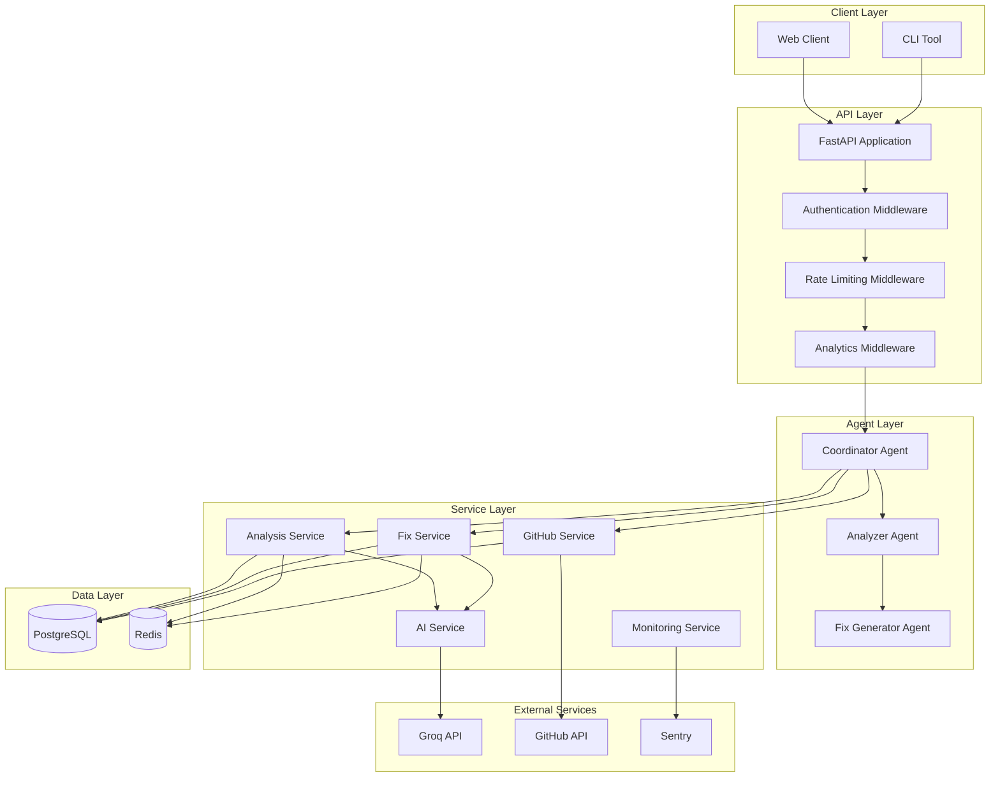
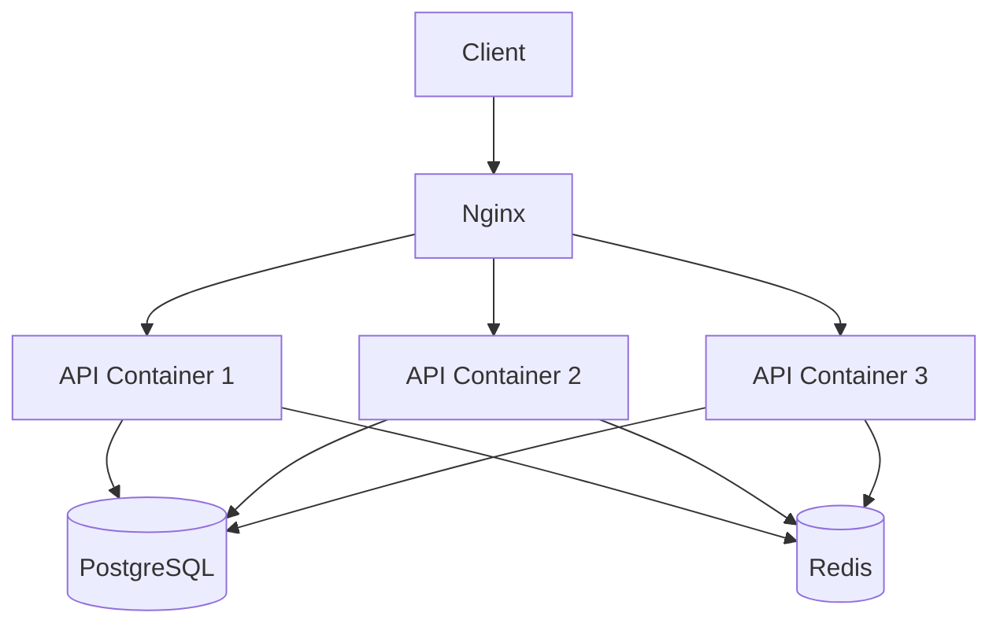

# AgentLogger Architecture

This document provides an overview of the AgentLogger architecture.

## System Architecture

AgentLogger follows an agent-based architecture with multiple layers:

## Layer Descriptions

### Client Layer

The Client Layer consists of:
- **Web Client**: A web interface for interacting with the API
- **CLI Tool**: A command-line tool for interacting with the API

### API Layer

The API Layer consists of:
- **FastAPI Application**: The main application that handles HTTP requests and responses
- **Authentication Middleware**: Validates API keys and handles authentication
- **Rate Limiting Middleware**: Enforces rate limits on API calls
- **Analytics Middleware**: Tracks API usage and performance

### Agent Layer

The Agent Layer consists of:
- **Coordinator Agent**: Orchestrates the debugging process
- **Analyzer Agent**: Analyzes code for issues
- **Fix Generator Agent**: Generates fixes for identified issues

### Service Layer

The Service Layer consists of:
- **Analysis Service**: Handles code analysis
- **Fix Service**: Handles fix generation
- **GitHub Service**: Handles GitHub integration
- **Monitoring Service**: Handles analytics and monitoring
- **AI Service**: Handles AI model integration

### External Services

The External Services consist of:
- **Groq API**: Provides AI capabilities
- **GitHub API**: Enables GitHub integration
- **Sentry**: Provides error tracking and performance monitoring

### Data Layer

The Data Layer consists of:
- **PostgreSQL**: Stores persistent data
- **Redis**: Provides caching and session management

## Communication Flow

1. Clients (Web or CLI) send requests to the FastAPI application
2. The request passes through middleware for authentication, rate limiting, and analytics
3. The Coordinator Agent receives the request and determines the appropriate action
4. The Coordinator Agent delegates tasks to specialized agents
5. The agents use services to perform their tasks
6. The services interact with external services and data stores
7. The results are returned to the client

## Deployment Architecture

For production deployments, AgentLogger uses a containerized architecture with:
- Nginx as a reverse proxy
- Multiple API containers for horizontal scaling
- PostgreSQL for persistent storage
- Redis for caching and session management

This architecture provides high availability, scalability, and performance. 